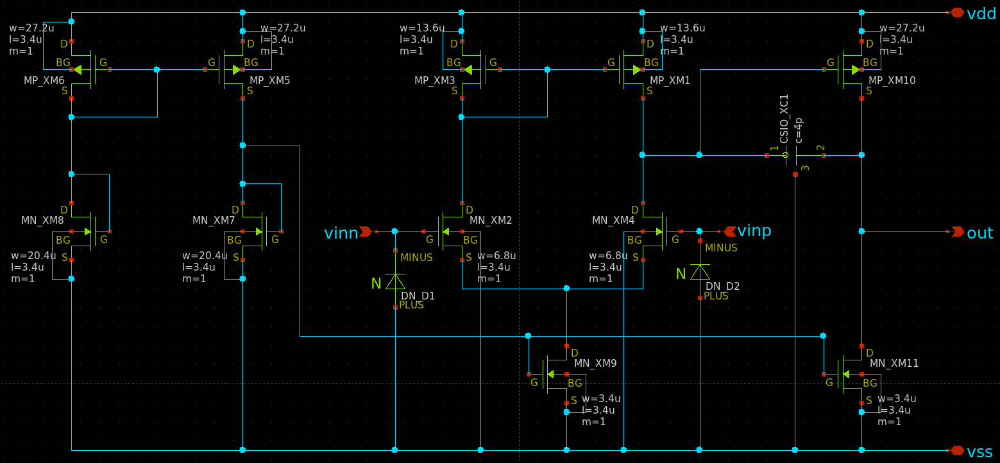
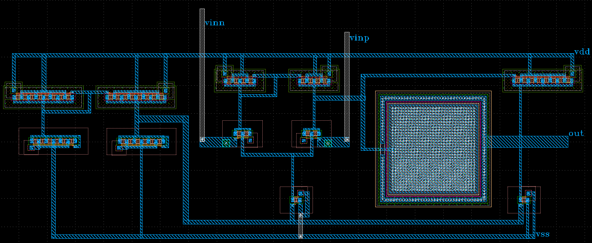
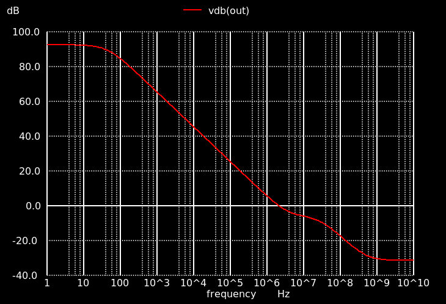
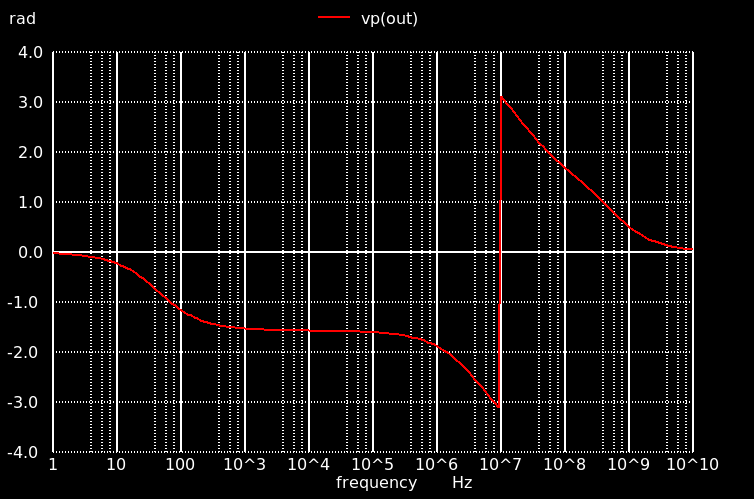
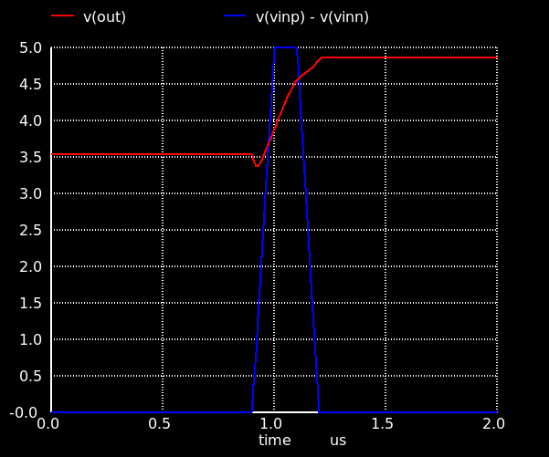

## 参加イベント
[ISHI会版OpenMPW TR10-2の OPAMPのグループワーク](https://ishi-kai.org/openmpw/shuttle/tr10/2025/08/01/shuttle_ISHI-Kai_OpenMPW-TR10-2_start.html)
　
## 感想
あいうえお  
かきくけこ  
さしすせそ
## 特性
| 項目 | 値 |
| --- | --- |
| 直流利得 | 105 dB |
| 単位利得周波数 | 1.18 MHz |
| 位相余裕 | 61.6° |
| CMRR | 97 dB |
| スルーレート | 9.0 V/μs |

## 回路図

## レイアウト

## オープンループ特性

## CMRR評価

## 過渡応答

